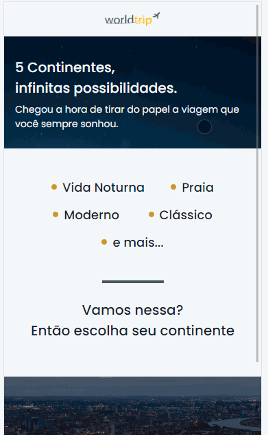

<p align="center">

</p>

<h2>World Trip Application 💻</h2>

<p>
 World Trip web application intends to be a web responsive aplication, which has as main purpose to put into practice the knowledge acquired througout the React course provided by the Rocketseat platform. 
</p>

<p>
This application was developed using the following tecnologies:
</p>
<ul>
<li> React JS (<small>version 17.0.2</small>)</li>
<li> Next JS (<small>version ^12.1.1</small>)</li>
<li> Chackra UI (<small>version ^10.1.1</small>)</li>
<li> TypeScript (<small>version ^4.2.4</small>)</li>
</ul>

<h2>Widescreen Sample</h2>
<p align="center">
    
</p>

<h2>Mobile Sample</h2>
<p align="center">
    
</p>

## Getting Started

Run the development server:

```bash
yarn run dev
```
## Learn More

To learn more about Next.js, take a look at the following resources:

- [Next.js Documentation](https://nextjs.org/docs) - learn about Next.js features and API.
- [Learn Next.js](https://nextjs.org/learn) - an interactive Next.js tutorial.

You can check out [the Next.js GitHub repository](https://github.com/vercel/next.js/) - your feedback and contributions are welcome!

## Deploy on Vercel

The easiest way to deploy your Next.js app is to use the [Vercel Platform](https://vercel.com/new?utm_medium=default-template&filter=next.js&utm_source=create-next-app&utm_campaign=create-next-app-readme) from the creators of Next.js.

Check out our [Next.js deployment documentation](https://nextjs.org/docs/deployment) for more details.
